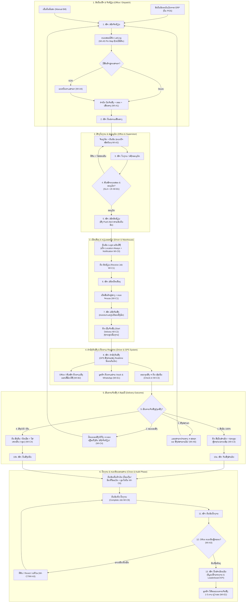

# 🔄 Workflow — ຂັ້ນຕອນການເຮັດວຽກ ODG TMS

ເອກະສານນີ້ອະທິບາຍ **ວົງຈອນຊີວິດ 11 ສະຖານະຂອງບິນ/ໃບງານ** ຕັ້ງແຕ່ຮັບເຂົ້າ ຈົນປິດງານ ພ້ອມ Swimlane, Decision Tree ແລະ 10 ກໍລະນີພິເສດ.

---

## 1. ພາບລວມວົງຈອນ 11 ສະຖານະ (End-to-End Diagram)

---

## 2. ຕາຕະລາງ Swimlane 11 ຂັ້ນຕອນ

| ຂັ້ນ | ສະຖານະ (ເມນູ) | ຜູ້ຮັບຜິດຊອບ | ເຄື່ອງມື | ຜົນທີ່ໄດ້ |
|-----|----------------|--------------|---------|-----------|
| 1 | ລໍຖ້າຈັດຖ້ຽວ | Office / Dispatch | Web Dashboard | ບິນຖືກກຳນົດ ວັນ/ຮອບ/ເສັ້ນທາງ |
| 2 | ບິນລໍຕາມເສັ້ນທາງ | Office / Dispatch | Web Dashboard | ບິນຖືກຈັດກຸ່ມຕາມເສັ້ນທາງ |
| 3 | ໃບງານ/ລໍຖ້າອະນຸມັດ | Office / Dispatch | Web Dashboard | ໃບງານພ້ອມສົ່ງອະນຸມັດ |
| 4 | ອະນຸມັດ | ຫົວໜ້າ/ຜູ້ຄຸມ | Web Dashboard | ໃບງານຖືກອະນຸມັດ (SLA < 2h) |
| 5 | ລໍຖ້າຮັບຖ້ຽວ | ຄົນຂັບລົດ | ແອັບມືຖື | ຄົນຂັບຮັບໃບງານ |
| 6 | ລໍຖ້າເບີກເຄື່ອງ | ຄົນຂັບ + ສາງ | ແອັບ + ສາງ | ເບີກສິນຄ້າຄົບຖ້ວນ |
| 7 | ລໍຖ້າຈັດສົ່ງ | ຄົນຂັບລົດ | ແອັບມືຖື | ລົດພ້ອມອອກແລ່ນ |
| 8 | ກຳລັງຈັດສົ່ງ | ຄົນຂັບລົດ | ແອັບ + GPS | ຕິດຕາມຕຳແໜ່ງ Realtime |
| 9 | ຈັດສົ່ງສຳເລັດ / ບໍ່ຄົບ | ຄົນຂັບລົດ | ແອັບມືຖື | ຫຼັກຖານການສົ່ງ (ຮູບ/ລາຍເຊັນ) |
| 10 | ຄົນຂັບປິດງານ | ຄົນຂັບລົດ | ແອັບມືຖື | ໃບງານຖືກປິດຈາກຄົນຂັບ |
| 11 | ປິດສຳເລັດແລ້ວ | Office / ຫົວໜ້າ | Web Dashboard | ໃບງານປິດ 100%, ເຂົ້າລາຍງານ KPI |

---

## 3. ຈຸດຕັດສິນໃຈສຳຄັນ (Decision Points)

### 3.1 ການອະນຸມັດ ຫຼື ຕີກັບ (ຂັ້ນ 4)
ຫົວໜ້າກວດສອບ: ລົດ/ຄົນຂັບເໝາະສົມ, ນ້ຳໜັກບໍ່ເກີນ, ເສັ້ນທາງສົມເຫດສົມຜົນ.
- **ຜ່ານ** ➔ ສະຖານະປ່ຽນເປັນ *ລໍຖ້າຮັບຖ້ຽວ* (Push Alert ຫາຄົນຂັບ).
- **ບໍ່ຜ່ານ** ➔ ກົດ *ຕີກັບ* ພ້ອມໃສ່ເຫດຜົນ ➔ ເດັ້ງກັບ Office ແກ້ໄຂ.

### 3.2 ຜົນການຈັດສົ່ງຢູ່ຈຸດສົ່ງ (ຂັ້ນ 9)
- **ສົ່ງຄົບ (100%):** ຄົນຂັບກົດ *ສົ່ງບິນສຳເລັດ* + ຖ່າຍຮູບຫຼັກຖານ/ລາຍເຊັນ ➔ *ຈັດສົ່ງສຳເລັດ*.
- **ທະຍອຍສົ່ງ (Partial Delivery):** ສົ່ງໄດ້ບາງສ່ວນ, ມີສິນຄ້າຄ້າງ (`remaining_qty > 0`). ລະບົບປ່ຽນສະຖານະເປັນ **"ທະຍອຍສົ່ງ"** ອັດຕະໂນມັດ ແລະ ດຶງບິນກັບມາທີ່ *ລໍຖ້າຈັດຖ້ຽວ* ເພື່ອໃຫ້ Office ຈັດຖ້ຽວຮອບຕໍ່ໄປ.
- **ສົ່ງບໍ່ຄົບ/ສົ່ງຄືນ (Return):** ສົ່ງບໍ່ໄດ້ເລີຍ / ຄືນສາງທັງໝົດ ➔ ກົດ *ສົ່ງຄືນ* ພ້ອມເຫດຜົນ ➔ ຈັດຮອບຕໍ່ໄປ.
- **ຍົກເລີກ (Cancel):** ກົດ *ຍົກເລີກ* ພ້ອມເຫດຜົນ (ຕ້ອງໄດ້ຮັບອະນຸຍາດຈາກຫົວໜ້າ).

### 3.3 ກວດຮັບກ່ອນປິດງານ (ຂັ້ນ 11)
Office ກວດຫຼັກຖານການສົ່ງ + ຈຳນວນ ກ່ອນກົດ *ປິດສຳເລັດ*. ຖ້າຂາດ/ຜິດ/ກົດຜິດ ໃຫ້ກົດ **ຕີກັບ (Revert)** ເພື່ອໃຫ້ຄົນຂັບແກ້ໄຂ.

### 3.4 ສົ່ງຕໍ່ສາຂາ (Branch Forwarding)
ເມື່ອຂົນສົ່ງສິນຄ້າໄປມອບໃຫ້ສາຂາປາຍທາງ, ຄົນຂັບກົດ *ສົ່ງຕໍ່ສາຂາ* ➔ ສະຖານະເປັນ **"ສົ່ງຕໍ່ສາຂາແລ້ວ" (forward_transport_code)** ➔ Push Notification ແຈ້ງເຕືອນສາຂາປາຍທາງ ແລະ ດຶງບິນເຂົ້າຄິວ *ລໍຖ້າຈັດຖ້ຽວ* ຂອງສາຂານັ້ນອັດຕະໂນມັດ.

---

## 4. 11 ກໍລະນີການເຮັດວຽກພິເສດ (Special Cases)

1. **ທະຍອຍສົ່ງ (Partial Delivery):** ສົ່ງໄດ້ບາງສ່ວນ ➔ ຍອດເຫຼືອເດັ້ງກັບ *ລໍຖ້າຈັດຖ້ຽວ*.
2. **ສົ່ງຕໍ່ສາຂາ (Branch Forwarding):** ຂົນສົ່ງມອບໃຫ້ສາຂາ ➔ ບິນເຂົ້າຄິວ *ລໍຖ້າຈັດຖ້ຽວ* ຂອງສາຂານັ້ນ.
3. **ແຍກບິນຕາມສາຂາ (Split Bill by Branch):** ບິນ 1 ໃບເບີກຫຼາຍສາງຄົນລະສາຂາ ➔ ລະບົບແຍກເປັນບິນຍ່ອຍ `ເລກບິນ#ສາຂາ` ໃຫ້ອັດຕະໂນມັດ ແຕ່ລະສາຂາຈັດຖ້ຽວສ່ວນຂອງຕົນເອງພ້ອມກັນໄດ້ (WI-A4).
4. **ເກັບເງິນປາຍທາງ (COD):** ບິນ `COD…` ຈາກ ERP ➔ ຄົນຂັບເກັບເງິນ + ບັນທຶກວິທີຊຳລະຕອນປິດບິນ (WI-C9) ➔ ການເງິນຮັບເງິນສົດຕໍ່ຖ້ຽວ (WI-A8).
5. **ຍ້ອນກັບ / ແກ້ໄຂ (Revert / Edit Delivery):** Office ກົດ Revert ຫຼື Edit ຖ້າກົດສົ່ງຜິດ (WI-A3/WI-C7).
6. **ເພີ່ມບິນເຂົ້າໃບງານເດີມ (Add Bills to Job):** ດຶງບິນດ່ວນເຂົ້າໃບງານເດີມໂດຍບໍ່ຕ້ອງສ້າງໃບງານໃໝ່.
7. **ປັກໝຸດຕຳແໜ່ງ (Edit Location / Pin Map):** ປັກໝຸດ Lat/Lng ເທິງ Google Maps ຖ້າບິນບໍ່ມີພິກັດ (WI-A5).
8. **ກຳນົດວັນ/ຮອບຈັດສົ່ງໃໝ່ (Reschedule Date & Round):** ຍ້າຍວັນຈັດສົ່ງຕາມລູກຄ້າຮ້ອງຂໍ.
9. **ບັນທຶກເຕີມນ້ຳມັນ (Fuel Entry):** ຄົນຂັບປ້ອນເງິນ/ລິດ/ກິໂລແມັດ + ຮູບໃບບິນຜ່ານແອັບ (WI-C6).
10. **WhatsApp Link & Public Track (`/track` & `/rate`):** ສົ່ງ Link ຕິດຕາມໃຫ້ລູກຄ້າ ແລະ ຮັບຄະແນນ 1-5 ດາວ.
11. **GPS Offline & Session Expired 8h:** ເປີດ Location Always, ປິດ Battery Saver, Logout/Login ໃໝ່ຖ້າ Session ໝົດ.

---

## 5. ດັດຊະນີ SLA ເວລາປະຕິບັດງານ (Recommended SLA)

| ຂັ້ນຕອນ | ເປົ້າໝາຍເວລາ (SLA) | Action ຖ້າເກີນເວລາ |
|---------|---------------------|--------------------|
| ຮັບບິນ → ຈັດຖ້ຽວ | ພາຍໃນ 4 ຊົ່ວໂມງ | Office ຕິດຕາມບິນຄ້າງ |
| ສ້າງໃບງານ → ອະນຸມັດ | < 2 ຊົ່ວໂມງ | ລະບົບແຈ້ງເຕືອນຫົວໜ້າ |
| ອະນຸມັດ → ຮັບຖ້ຽວ | < 1 ຊົ່ວໂມງ | ໂທຕິດຕາມຄົນຂັບລົດ |
| ເບີກເຄື່ອງ → ເລີ່ມຈັດສົ່ງ | < 30 ນາທີ | ປະສານງານສາງສິນຄ້າ |
