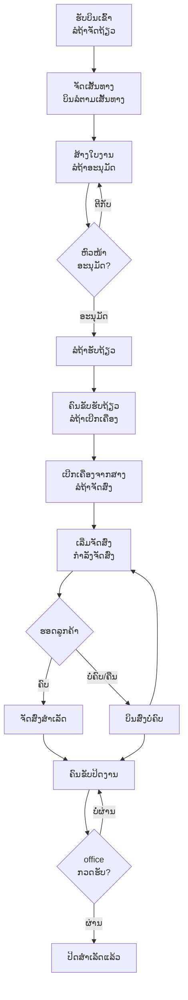

# Workflow — ຂັ້ນຕອນການເຮັດວຽກ ODG TMS

ເອກະສານນີ້ອະທິບາຍ **ວົງຈອນຊີວິດຂອງບິນ/ໃບງານ** ຕັ້ງແຕ່ຮັບເຂົ້າ ຈົນປິດງານ ພ້ອມບອກວ່າ **ໃຜ** ຮັບຊ່ວງໃສ ແລະ **ເຮັດຢູ່ບ່ອນໃດ** ໃນລະບົບ.

---

## 1. ພາບລວມວົງຈອນ (End-to-End)

---

## 2. ຕາຕະລາງຂັ້ນຕອນ (Swimlane)

| ຂັ້ນ | ສະຖານະ (ເມນູ) | ຜູ້ຮັບຜິດຊອບ | ເຄື່ອງມື | ຜົນທີ່ໄດ້ |
|-----|----------------|--------------|---------|-----------|
| 1 | ລໍຖ້າຈັດຖ້ຽວ | office/dispatch | Web | ບິນຖືກກຳນົດວັນ/ຮອບ/ເສັ້ນທາງ |
| 2 | ບິນລໍຕາມເສັ້ນທາງ | office/dispatch | Web | ບິນຈັດກຸ່ມຕາມເສັ້ນທາງ |
| 3 | ໃບງານ/ລໍຖ້າອະນຸມັດ | office/dispatch | Web | ໃບງານພ້ອມສົ່ງອະນຸມັດ |
| 4 | ອະນຸມັດ | ຫົວໜ້າ/ຜູ້ຄຸມ | Web | ໃບງານຖືກອະນຸມັດ |
| 5 | ລໍຖ້າຮັບຖ້ຽວ | ຄົນຂັບ | ແອັບ | ຄົນຂັບຮັບໃບງານ |
| 6 | ລໍຖ້າເບີກເຄື່ອງ | ຄົນຂັບ + ສາງ | ແອັບ | ເບີກສິນຄ້າຄົບ |
| 7 | ລໍຖ້າຈັດສົ່ງ | ຄົນຂັບ | ແອັບ | ພ້ອມອອກລົດ |
| 8 | ກຳລັງຈັດສົ່ງ | ຄົນຂັບ | ແອັບ + GPS | ລົດແລ່ນ, ຕິດຕາມ realtime |
| 9 | ຈັດສົ່ງສຳເລັດ / ບໍ່ຄົບ | ຄົນຂັບ | ແອັບ | ຫຼັກຖານການສົ່ງ (ຮູບ) |
| 10 | ຄົນຂັບປິດງານ | ຄົນຂັບ | ແອັບ | ໃບງານປິດຈາກຄົນຂັບ |
| 11 | ປິດສຳເລັດແລ້ວ | office/ຫົວໜ້າ | Web | ໃບງານປິດ, ເຂົ້າລາຍງານ |

---

## 3. ຈຸດຕັດສິນໃຈສຳຄັນ (Decision Points)

### 3.1 ອະນຸມັດ ຫຼື ຕີກັບ (ຂັ້ນ 4)
ຫົວໜ້າກວດ: ລົດ/ຄົນຂັບເໝາະສົມ, ນ້ຳໜັກ/ຈຳນວນບໍ່ເກີນ, ເສັ້ນທາງສົມເຫດສົມຜົນ.
- **ຜ່ານ** → ໄປ *ລໍຖ້າຮັບຖ້ຽວ*.
- **ບໍ່ຜ່ານ** → ຕີກັບໃຫ້ office ແກ້ໄຂ ພ້ອມລະບຸເຫດຜົນ.

### 3.2 ສົ່ງຄົບ ຫຼື ບໍ່ຄົບ (ຂັ້ນ 9)
- **ຄົບ** → ຄົນຂັບກົດ *ສົ່ງບິນສຳເລັດ* + ຖ່າຍຮູບຫຼັກຖານ → *ຈັດສົ່ງສຳເລັດ*.
- **ບໍ່ຄົບ/ຄືນ** → ກົດ *ສົ່ງຄືນ (return)* ພ້ອມເຫດຜົນ → *ບິນສົ່ງບໍ່ຄົບ* → ຈັດຮອບຕໍ່ໄປ.
- **ຍົກເລີກ** → ກົດ *ຍົກເລີກ (cancel)* ພ້ອມເຫດຜົນ (ຕ້ອງໄດ້ຮັບອະນຸຍາດ).

### 3.3 ກວດຮັບກ່ອນປິດ (ຂັ້ນ 11)
office ກວດຫຼັກຖານການສົ່ງ + ຈຳນວນ ກ່ອນປິດສຳເລັດ. ຖ້າຂາດ/ຜິດ ໃຫ້ຕີກັບໃຫ້ຄົນຂັບແກ້ (revert/edit).

---

## 4. ຂະບວນການເສີມ (Supporting Workflows)

### 4.1 GPS Tracking (ອັດຕະໂນມັດ)
ຂະນະ *ກຳລັງຈັດສົ່ງ* ແອັບຄົນຂັບສົ່ງພິກັດເປັນ batch ໃຫ້ລະບົບ. office/ຫົວໜ້າເບິ່ງໄດ້ທັນທີທີ່ *ແຜນທີ່ລົດ / ແຜນທີ່ມືຖື*. ຖ້າສົ່ງບໍ່ໄດ້ ແອັບຈະລາຍງານເຫດຜົນ (GPS ປິດ / ບໍ່ໄດ້ອະນຸຍາດ / token ໝົດອາຍຸ).

### 4.2 ບັນທຶກນ້ຳມັນ
ຄົນຂັບເຕີມນ້ຳມັນ → ບັນທຶກຈຳນວນ + ຖ່າຍຮູບໃບບິນຜ່ານແອັບ → office ກວດ/ສະຫຼຸບຢູ່ໜ້າ *ນ້ຳມັນ*.

### 4.3 ການແຈ້ງເຕືອນ (Notifications)
ລະບົບສົ່ງແຈ້ງເຕືອນ (push) ຫາຄົນຂັບ/ຜູ້ກ່ຽວຂ້ອງ ເມື່ອມີໃບງານໃໝ່, ອະນຸມັດ, ຫຼື ເຕືອນ dispatch/KPI (ຜ່ານ cron). ຝ່າຍຂາຍໄດ້ຮັບແຈ້ງເມື່ອບິນຂອງຕົນປ່ຽນສະຖານະ.

### 4.4 ຕິດຕາມສາທາລະນະ & ຄະແນນ
ລູກຄ້າຕິດຕາມທີ່ `/track` ແລະ ໃຫ້ຄະແນນທີ່ `/rate` ຫຼັງໄດ້ຮັບສິນຄ້າ.

---

## 5. SLA / ຈຸດເຝົ້າລະວັງ (ແນະນຳ)
> ຄ່າ SLA ຂ້າງລຸ່ມແມ່ນ**ຄ່າແນະນຳ** — ໃຫ້ຫົວໜ້າປັບຕາມນະໂຍບາຍຈິງ.

| ຂັ້ນຕອນ | ເປົ້າໝາຍເວລາ | ຖ້າເກີນ |
|---------|--------------|---------|
| ຮັບບິນ → ຈັດຖ້ຽວ | ພາຍໃນວັນ | office ຕິດຕາມ |
| ສ້າງໃບງານ → ອະນຸມັດ | < 2 ຊມ | ເຕືອນຫົວໜ້າ |
| ອະນຸມັດ → ຮັບຖ້ຽວ | < 1 ຊມ | ໂທຫາຄົນຂັບ |
| ເລີ່ມສົ່ງ → ສຳເລັດ | ຕາມເສັ້ນທາງ | ກວດ GPS |
| ສົ່ງສຳເລັດ → ປິດງານ | ວັນດຽວກັນ | office ກວດຮັບ |
